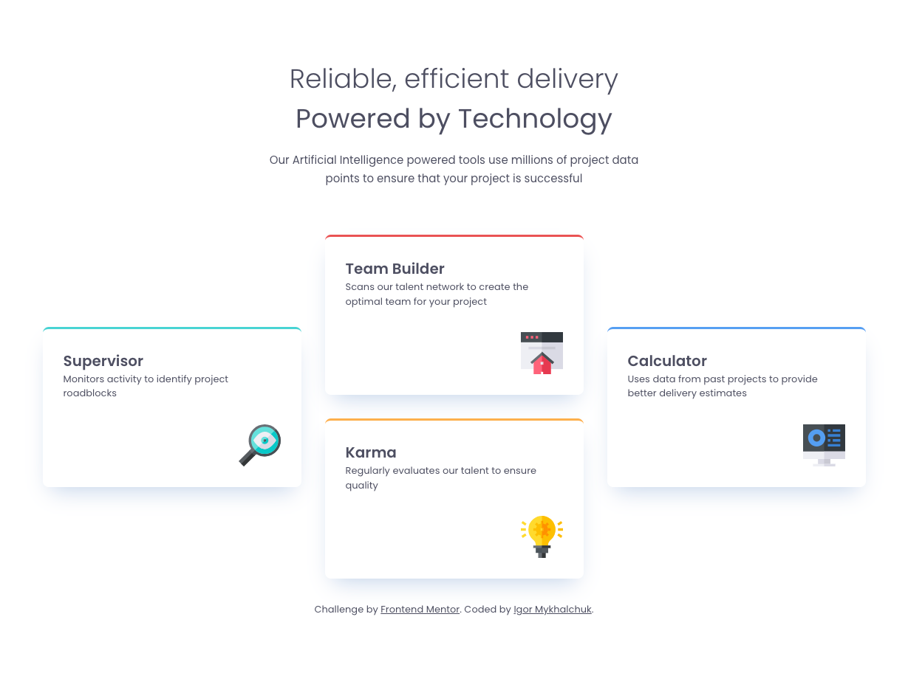
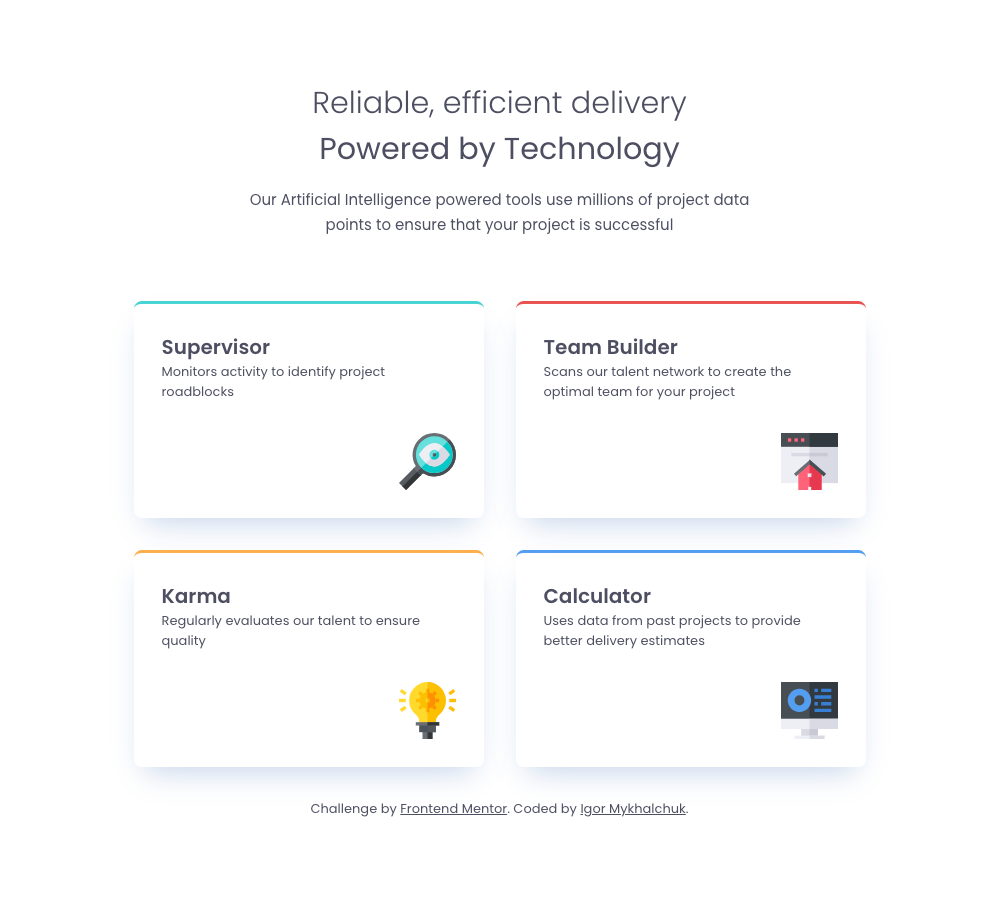
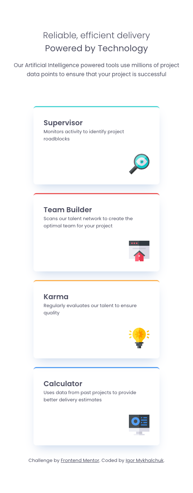

# Frontend Mentor - Four card feature section solution

This is a solution to the [Four card feature section challenge on Frontend Mentor](https://www.frontendmentor.io/challenges/four-card-feature-section-weK1eFYK). 
### The challenge

Users should be able to:

- View the optimal layout for the site depending on their device's screen size

### Screenshots

#### Desktop

  

#### Tablet

  

#### Mobile

  

### Built with

- Semantic HTML5 markup
- CSS custom properties
- Flexbox
- CSS grid
- Media queries
- Visual Studio Code
